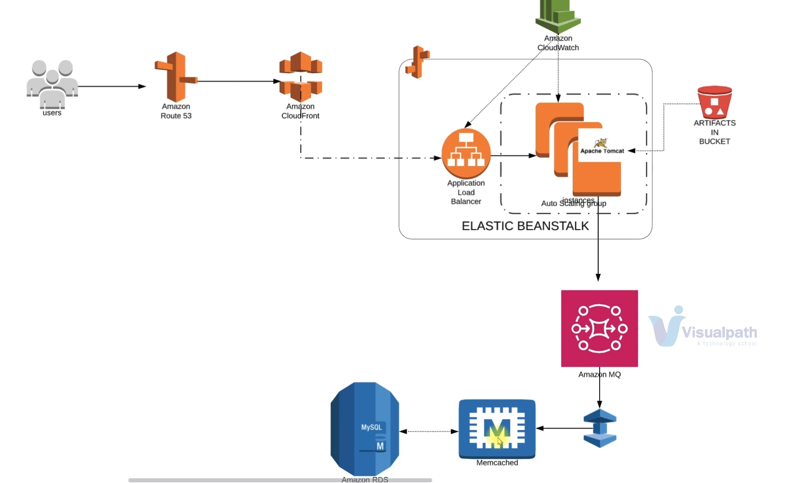
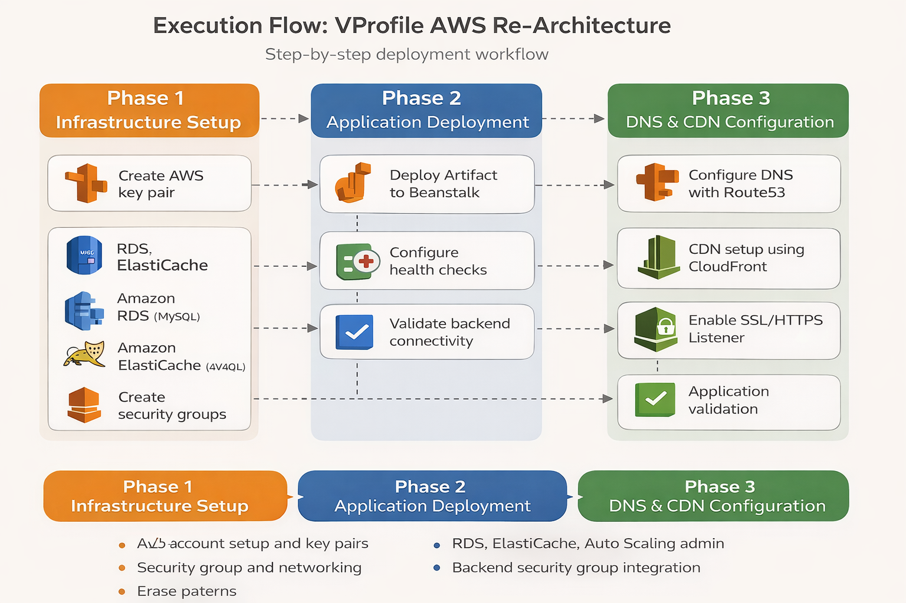

# 🚀 VProfile AWS Re-Architecture Project


## 📌 Overview
This project demonstrates the re-architecture of a traditional multi-tier web application (VPROFILE)
from on-prem / VM-based infrastructure to AWS Cloud using managed services.

The objective is to improve scalability, availability, automation, and cost efficiency
while reducing operational overhead.

---

## 🎯 Problem Statement
The existing system suffered from:
- High operational overhead
- Manual provisioning and deployments
- Scaling and uptime challenges
- Upfront CapEx and recurring OpEx
- Limited automation

---

## 📈 Solution Approach
The application was re-architected using AWS managed services with:
- Infrastructure automation readiness
- Pay-as-you-go cost model
- High availability and scalability
- Reduced system administration effort

---

## 🎯Results / Outcomes

- Improved scalability using Elastic Beanstalk auto-scaling
- Reduced infrastructure management overhead by ~70% (no manual VM ops)
- Achieved high availability with managed AWS services
- Reduced latency using CloudFront CDN and ElastiCache
- Enabled production-ready traffic routing via ALB + Route53

---

## 🏗️ Architecture 


## Key Architecture Decisions

- Chose Elastic Beanstalk over EC2 for managed scaling and reduced ops overhead
- Used ElastiCache to reduce database load and improve response latency
- Implemented ALB for layer 7 routing and SSL termination
- Integrated CloudFront to optimize global content delivery
- Used security group referencing for backend service isolation

### Traffic Flow:
User → Route53 (DNS) → CloudFront (CDN) → ALB → Elastic Beanstalk (App Tier) → RDS / ElastiCache / ActiveMQ

---

## ▶️ How to Deploy (Quick Start)

* This section provides a high-level deployment flow.  
* Detailed steps are documented under `execution-flow/`.

### Prerequisites
- AWS account
- AWS CLI configured with appropriate IAM permissions
- Java and Maven installed
- Domain name (optional, for Route 53 and CloudFront)

### Steps
#### 1. Clone the repository:
```bash
   git clone https://github.com/josephmj0303/vprofile-aws-rearchitecture.git
```
#### 2. Configure AWS credentials:
```
aws configure
```
#### 3. Provision AWS resources by following:
```
execution-flow/
├── phase-1-infra-setup.md
├── phase-2-app-deployment.md
└── phase-3-dns-cdn.md
```
#### 4. Build and deploy the application:

- Update backend configuration with AWS service endpoints

- Build artifact using Maven

- Deploy artifact to Elastic Beanstalk

#### 5. Deployment Validation
Runtime behavior was verified using:
- Successful application login and dashboard access
- Cache miss → DB fetch → cache insert
- Cache hit → data served from ElastiCache

Screenshots are available in the `screenshots/` directory.

---

## 🔧 AWS Services Used
| Service | Purpose |
|------|-------|
| Elastic Beanstalk | Application hosting & auto scaling |
| Application Load Balancer | Traffic distribution |
| Amazon RDS | Managed relational database |
| Amazon ElastiCache | In-memory caching |
| Amazon ActiveMQ | Message broker |
| Amazon S3 / EFS | Artifact & shared storage |
| Route 53 | DNS management |
| CloudFront | Content Delivery Network |

---

## 🧠 Execution Flow Summary
1. AWS account setup & key pairs
2. Security group design
3. RDS, ElastiCache, ActiveMQ provisioning
4. Elastic Beanstalk environment creation
5. Backend security group integration
6. Application artifact build
7. Deployment to Beanstalk
8. SSL & HTTPS listener configuration
9. CDN & DNS configuration
10. Application validation



---

## 🎯 Key DevOps Highlights
- Re-architected monolithic VM deployment into managed AWS services
- Implemented caching layer and validated cache hit/miss behavior
- Isolated backend services using security group referencing
- Designed deployment flow aligned with production environments
- Reduced operational burden by removing manual server maintenance

---

## 📁 Repository Structure
```
vprofile-aws-rearchitecture/
│
├── README.md
│
├── architecture/
│   ├── current-state.md
│   ├── target-aws-architecture.md
│   └── aws-services-mapping.md
│
├── diagrams/
│   ├── aws-architecture.png
│   └── execution_flow.png
│   
├── infrastructure/
│   ├── security-groups.md
│   └── networking.md
│   
├── services/
│   ├── elastic-beanstalk.md
│   ├── rds.md
│   ├── elasticache.md
│   ├── active-mq.md
│   └── route53-cloudfront.md
│
├── execution-flow/
│   ├── phase-1-infra-setup.md
│   ├── phase-2-app-deployment.md
│   └── phase-3-dns-cdn.md
│
└── screenshots/
    ├── app-login.png
    ├── app-home.png
    ├── cache-miss.png
    └── cache-hit.png
```
---

## 📈 Future Enhancements
- Infrastructure as Code (Terraform)
- CI/CD pipeline (GitHub Actions / Jenkins)
- Blue-Green deployments
- Monitoring with CloudWatch & alarms

---

## 👨‍💻 Author
DevOps Portfolio Project  
AWS | Linux | Cloud Architecture

